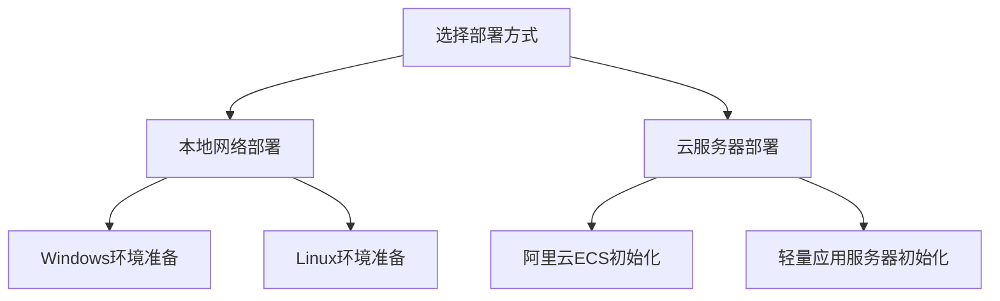
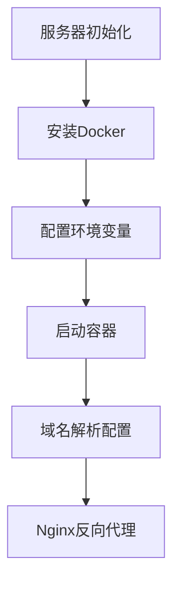

# 设备管理系统部署指南

## 部署方式对比
| 项目          | 本地网络部署                   | 云服务器部署                   |
|---------------|------------------------------|------------------------------|
| 服务器要求     | 支持虚拟化的Windows/Linux PC  | 1核2G 云服务器（推荐2核4G）    |
| 网络环境      | 需要路由器端口映射            | 需配置安全组开放80/8000端口    |
| 公网访问      | 需要DDNS动态域名              | 绑定域名+备案                 |
| 成本         | 电费+网络费用                 | 云服务器租用费用              |

## 部署流程概览


## 本地网络部署
### 1. 环境准备
#### 通用要求
- Docker Desktop 4.15+
- Git版本管理工具
- 8000端口（应用服务）和80端口（Nginx）需在防火墙放行

### 2. 操作系统初始化
1. 启用WSL2功能（可选）
```powershell
# 以管理员身份运行PowerShell
dism.exe /online /enable-feature /featurename:Microsoft-Windows-Subsystem-Linux /all /norestart
dism.exe /online /enable-feature /featurename:VirtualMachinePlatform /all /norestart
wsl --set-default-version 2
```

2. 基础工具安装（PowerShell）
```powershell
# 更新系统组件
Install-Module -Name PSWindowsUpdate -Force
Install-WindowsUpdate -AcceptAll -AutoReboot

# 安装Chocolatey包管理器
Set-ExecutionPolicy Bypass -Scope Process -Force
[System.Net.ServicePointManager]::SecurityProtocol = [System.Net.ServicePointManager]::SecurityProtocol -bor 3072
iex ((New-Object System.Net.WebClient).DownloadString('https://chocolatey.org/install.ps1'))

# 安装Git和Docker Desktop
choco install git docker-desktop -y

# 验证安装
git --version
docker --version

# 如果出现命令未找到错误，请按以下步骤安装:
# 1. 以管理员身份运行PowerShell
# 2. 安装Chocolatey包管理器
Set-ExecutionPolicy Bypass -Scope Process -Force
[System.Net.ServicePointManager]::SecurityProtocol = [System.Net.ServicePointManager]::SecurityProtocol -bor 3072
iex ((New-Object System.Net.WebClient).DownloadString('https://chocolatey.org/install.ps1'))

# 3. 验证Chocolatey安装
if (!(Get-Command choco -ErrorAction SilentlyContinue)) {
    Write-Host "Chocolatey安装失败，请检查网络连接后重试"
    exit 1
}

# 4. 使用Chocolatey安装Git和Docker Desktop
choco install git docker-desktop -y

# 5. 检查环境变量
Write-Host "检查系统PATH环境变量..."
$env:PATH -split ';' | Where-Object { $_ -like '*Git*' -or $_ -like '*Docker*' }

# 6. 如果命令仍不可用，请手动添加路径
if (!(Get-Command git -ErrorAction SilentlyContinue)) {
    Write-Host "Git命令未找到，尝试手动添加路径..."
    $gitPath = "C:\\Program Files\\Git\\cmd"
    if (Test-Path $gitPath) {
        $env:PATH += ";$gitPath"
        # 持久化环境变量设置
        [System.Environment]::SetEnvironmentVariable("PATH", [System.Environment]::GetEnvironmentVariable("PATH", "Machine") + ";$gitPath", "Machine")
        Write-Host "已永久添加Git路径到系统环境变量"
    } else {
        Write-Host "错误：Git安装路径不存在，请确认Git是否正确安装"
    }
}

if (!(Get-Command docker -ErrorAction SilentlyContinue)) {
    Write-Host "Docker命令未找到，尝试手动添加路径..."
    $dockerPath = "C:\\Program Files\\Docker\\Docker\\resources\\bin"
    if (Test-Path $dockerPath) {
        $env:PATH += ";$dockerPath"
        # 持久化环境变量设置
        [System.Environment]::SetEnvironmentVariable("PATH", [System.Environment]::GetEnvironmentVariable("PATH", "Machine") + ";$dockerPath", "Machine")
        Write-Host "已永久添加Docker路径到系统环境变量"
    } else {
        Write-Host "错误：Docker安装路径不存在，请确认Docker是否正确安装"
    }
}

# 7. 重新打开PowerShell并验证安装
git --version
docker --version

# 8. 环境变量深度验证（新增步骤）
Write-Host "\n=== 环境变量深度验证 ==="
# 检查Git和Docker是否在PATH中
$gitInPath = $env:PATH -split ';' | Where-Object { $_ -like '*Git*' }
$dockerInPath = $env:PATH -split ';' | Where-Object { $_ -like '*Docker*' }

if (!$gitInPath) {
    Write-Host "警告：Git路径未正确添加到系统环境变量"
    Write-Host "手动修复方法："
    Write-Host "1. 右键'此电脑' -> 属性 -> 高级系统设置 -> 环境变量"
    Write-Host "2. 在系统变量中找到PATH，添加Git的安装路径（通常为C:\\Program Files\\Git\\cmd）"
}

if (!$dockerInPath) {
    Write-Host "警告：Docker路径未正确添加到系统环境变量"
    Write-Host "手动修复方法："
    Write-Host "1. 右键'此电脑' -> 属性 -> 高级系统设置 -> 环境变量"
    Write-Host "2. 在系统变量中找到PATH，添加Docker的安装路径（通常为C:\\Program Files\\Docker\\Docker\\resources\\bin）"
}

# 验证环境变量是否生效
Write-Host "\n=== 最终验证 ==="
if (Get-Command git -ErrorAction SilentlyContinue) {
    Write-Host "√ Git命令可用"
} else {
    Write-Host "× Git命令不可用，请检查上述步骤"
}

if (Get-Command docker -ErrorAction SilentlyContinue) {
    Write-Host "√ Docker命令可用"
} else {
    Write-Host "× Docker命令不可用，请检查上述步骤"
}

Write-Host "\n提示：如果修改了系统环境变量，需要重新打开PowerShell窗口才能使更改生效。"
```

2. 部署步骤
```bash
# 克隆代码库
# 详细目录检查和删除步骤
if (Test-Path EquipmentMS) {
    # 检查目录是否为空
    $isEmpty = (Get-ChildItem -Path EquipmentMS -Force | Measure-Object).Count -eq 0
    
    if (!$isEmpty) {
        Write-Host "检测到非空目录EquipmentMS，正在删除..."
        # Windows PowerShell删除目录命令
        Remove-Item -Recurse -Force EquipmentMS
        
        # 验证删除是否成功
        if (Test-Path EquipmentMS) {
            Write-Host "错误：删除目录失败，请手动删除EquipmentMS目录后重试"
            exit 1
        } else {
            Write-Host "√ 已成功删除现有EquipmentMS目录"
        }
    } else {
        Write-Host "检测到空目录EquipmentMS，直接删除..."
        Remove-Item -Recurse -Force EquipmentMS
    }
}

# 克隆代码库
git clone https://github.com/yourrepo/EquipmentMS.git

# 验证克隆是否成功
try {
    if (!(Test-Path EquipmentMS)) {
        Write-Host "错误：克隆代码库失败，请检查网络连接和仓库地址" -ForegroundColor Red
        Write-Host "详细错误信息："
        Write-Host "1. 请确认Git已正确安装并添加到系统PATH"
        Write-Host "2. 请检查网络连接是否正常"
        Write-Host "3. 请确认仓库地址是否正确"
        Write-Host "4. 请检查当前目录是否有写入权限"
        
        # 记录错误日志
        $errorLog = "[$(Get-Date)] 克隆失败: 目录不存在 `"$pwd\EquipmentMS`""
        $errorLog | Out-File "$env:TEMP\EquipmentMS_Deploy_Errors.log" -Append
        
        # 提供修复建议
        Write-Host "\n修复建议："
        Write-Host "1. 手动创建EquipmentMS目录并重试"
        Write-Host "2. 以管理员身份运行PowerShell"
        Write-Host "3. 检查Git配置: git config --list"
        
        # 暂停5秒让用户查看错误信息
        Start-Sleep -Seconds 5
        exit 1
    } else {
        Write-Host "√ 代码库克隆成功" -ForegroundColor Green
        
        # 记录成功日志
        $successLog = "[$(Get-Date)] 克隆成功: $pwd\EquipmentMS"
        $successLog | Out-File "$env:TEMP\EquipmentMS_Deploy_Success.log" -Append
    }
} catch {
    Write-Host "发生意外错误: $_" -ForegroundColor Red
    Write-Host "详细错误信息: $($_.Exception.Message)"
    Write-Host "错误位置: $($_.InvocationInfo.ScriptName)"
    Write-Host "行号: $($_.InvocationInfo.ScriptLineNumber)"
    
    # 记录异常日志
    $exceptionLog = "[$(Get-Date)] 异常错误: $_`n$($_.Exception.Message)`n$($_.InvocationInfo.PositionMessage)"
    $exceptionLog | Out-File "$env:TEMP\EquipmentMS_Deploy_Errors.log" -Append
    
    # 暂停10秒让用户查看错误信息
    Start-Sleep -Seconds 10
    exit 1
}

# 进入部署目录
cd EquipmentMS/deploy

# 复制环境变量模板
cp .env.prod.example .env.prod

# 启动容器（生产模式）
docker-compose -f docker-compose.prod.yml up -d
```

## 阿里云ECS部署
3.1 服务器初始化
```bash
# 更新系统
sudo yum update -y

# 安装基础工具
sudo yum install -y yum-utils device-mapper-persistent-data lvm2 git

# 添加阿里云Docker镜像源
sudo yum-config-manager --add-repo https://mirrors.aliyun.com/docker-ce/linux/centos/docker-ce.repo

# 安装Docker
sudo yum install -y docker-ce docker-ce-cli containerd.io

# 配置阿里云镜像加速器（需登录容器镜像服务控制台获取个人加速器地址）
sudo mkdir -p /etc/docker
sudo tee /etc/docker/daemon.json <<-'EOF'
{
  "registry-mirrors": ["https://<your-aliyun-mirror>.mirror.aliyuncs.com"],
  "exec-opts": ["native.cgroupdriver=systemd"],
  "log-driver": "json-file",
  "log-opts": {
    "max-size": "100m"
  },
  "storage-driver": "overlay2"
}
EOF

# 启动Docker服务
sudo systemctl daemon-reload
sudo systemctl restart docker
sudo systemctl enable docker

# 添加当前用户到docker组（需重新登录生效）
sudo usermod -aG docker $USER

# 验证Docker安装
docker --version
docker info

# 安装Docker Compose
sudo curl -L "https://github.com/docker/compose/releases/download/v2.20.3/docker-compose-$(uname -s)-$(uname -m)" -o /usr/local/bin/docker-compose
sudo chmod +x /usr/local/bin/docker-compose
docker-compose --version
```

注意事项：
1. 请替换<your-aliyun-mirror>为阿里云容器镜像服务中获取的个人加速器地址
2. 添加用户到docker组后需要退出重新登录才能生效
3. 建议配置日志轮转防止日志文件过大
3. 云服务器准备
   - 创建CentOS 8实例（推荐2核4G配置）
   - 安全组需放行：80/443（Web服务）、8000（应用服务）、5432（PostgreSQL）
   - 建议开启云盾基础防护和安装云监控插件

4. 域名与证书配置
```bash
# 登录服务器后操作
sudo yum install -y certbot
certbot certonly --standalone -d yourdomain.com
```

## 阿里云ECS部署
5. 生产环境启动（使用HTTPS）
```bash
# 设置部署目录环境变量
export DEPLOY_DIR=/opt/EquipmentMS/deploy

# 克隆代码库
sudo git clone https://github.com/yourrepo/EquipmentMS.git /opt/EquipmentMS

# 启动数据库迁移
sudo docker-compose -f $DEPLOY_DIR/docker-compose.prod.yml run --rm web python manage.py migrate --noinput

# 启动容器服务
sudo docker-compose -f $DEPLOY_DIR/docker-compose.prod.yml up -d

# 验证服务状态
echo "服务访问地址：https://$(curl -s http://100.100.100.200/latest/meta-data/public-ipv4)"
docker-compose -f docker-compose.prod.yml run --rm web python manage.py migrate
docker-compose -f docker-compose.prod.yml up -d
```

### 最低配置要求
- CPU：1核（推荐2核）
- 内存：2GB（推荐4GB）
- 存储：系统盘40GB + 数据盘50GB（根据设备数量扩展）
- 带宽：3Mbps（推荐按需购买弹性带宽）

### 轻量服务器优化建议
1. 调整Docker资源限制：
   ```bash
   # 限制容器内存使用
   docker update --memory 1.5G --memory-swap 1.5G equipmentms_web_1
   ```
2. 关闭非必要服务：
   ```bash
   # 停止开发模式容器
   docker-compose -f docker-compose.dev.yml down
   ```
3. 启用SWAP分区（仅内存不足时）：
   ```bash
   sudo fallocate -l 2G /swapfile
   sudo chmod 600 /swapfile
   sudo mkswap /swapfile
   sudo swapon /swapfile
   ```

### 安全组配置示例（阿里云控制台）
```
入方向规则：
协议类型   端口范围    授权对象      备注
TCP        80        0.0.0.0/0     Web访问
TCP        443       0.0.0.0/0     HTTPS
TCP        8000      0.0.0.0/0     REST API
TCP        5432      172.16.0.0/16 PostgreSQL内网访问
```

3.2 容器镜像加速
```bash
# 更换阿里云镜像加速地址（需登录控制台获取个人镜像地址）
sudo tee /etc/docker/daemon.json <<-'EOF'
{
  "registry-mirrors": ["https://xxxxxxxx.mirror.aliyuncs.com"]
}
EOF
sudo systemctl daemon-reload
sudo systemctl restart docker
```

### 部署流程图


## 常见问题
Q: 本地部署如何远程访问？
A: 需在路由器设置端口转发（80→服务器IP:80，8000→服务器IP:8000）

Q: 云服务器后台上传速度慢？
A: 建议：1）升级带宽 2）使用OSS对象存储分离静态文件

## GitHub上传指南
### 0. 配置Git用户信息
```bash
# 设置全局用户名和邮箱
git config --global user.name "Your Name"
git config --global user.email "your.email@example.com"
```

### 1. 初始化Git仓库
```bash
# 在项目根目录执行
git init
```

### 2. 添加远程仓库
```bash
git remote add origin https://github.com/yourusername/EquipmentMS.git
```

### 3. 添加并提交所有文件
```bash
git add .
git commit -m "Initial commit"
```

### 4. 推送代码到GitHub
```bash
# 检查本地分支名称
git branch
# 如果本地分支不是main，可以重命名或创建新分支
git checkout -b main
# 推送代码
git push -u origin main
```

### 注意事项
1. 确保Git已正确安装并配置用户名和邮箱
2. 首次推送可能需要GitHub账号认证
3. 如果遇到权限问题，请检查远程仓库地址是否正确
4. 如果遇到分支名称不匹配错误，请检查本地和远程分支名称是否一致
5. 可以使用以下命令查看远程分支：
```bash
git remote show origin
```
## 本地网络部署
3. 防火墙设置
   Windows系统：
   ```powershell
   # 需要以管理员身份运行PowerShell
   New-NetFirewallRule -DisplayName "EquipmentMS_HTTP" -Direction Inbound -Protocol TCP -LocalPort @('80','8000') -Action Allow
   ```
   Linux系统：
   ```bash
   sudo ufw allow 80/tcp
   sudo ufw allow 8000/tcp
   sudo ufw reload
   ```

## 运维管理
### 常用命令
```bash
# 查看服务日志
docker-compose -f docker-compose.prod.yml logs -f --tail=100 web

# 进入容器执行命令
docker exec -it equipmentms_web_1 bash

# 数据库备份
pg_dump -h localhost -U postgres equipment_db > backup_$(date +%Y%m%d).sql
```

### 注意事项
1. 首次启动需通过`docker-compose run`执行数据库迁移
2. HTTPS证书需每3个月通过`certbot renew`续期
3. 阿里云镜像加速地址需登录容器镜像服务控制台获取实际地址
4. 建议每日凌晨通过crontab执行数据库备份
```
0 3 * * * pg_dump -h localhost -U postgres equipment_db > /backups/equipment_$(date +\%Y\%m\%d).sql
```