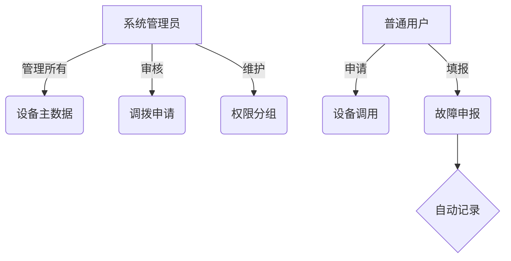

# 设备管理系统开发文档

## 系统架构
**技术栈**: Django 4.2 + PostgreSQL 15 + Vue3/Tailwind CSS

### 模块结构
```
EquipmentMS/
├── core/           # 核心模块
│   ├── rbac/       # 权限子系统
│   ├── utils/      # 扫码OCR工具
├── equipment/      # 设备生命周期
│   ├── models.py   # 主数据模型
├── inventory/      # 出入库管理
├── maintenance/    # 维修管理
├── templates/      # 管理后台模板
```

## 数据库设计
### 设备主表 (Equipment)
| 字段 | 类型 | 约束 |
|------|------|------|
| serial_num | CharField(30) | UNIQUE（扫码填充） |
| category | ForeignKey到Category | 带缓存加速 |
| purchase_year | SmallIntegerField | 校验区间1900-2100 |

## 接口规范
```python
# 设备调用接口示例
class EquipmentTransferAPI(APIView):
    def post(request):
        """
        参数: {
            dev_list: List[str], 
            from_project: int,
            to_project: int
        }
        返回: {transfer_no: '调拨单号', status: '审核状态'}
        """

# 故障申报接口示例
class FaultReportAPI(APIView):
    def post(request):
        """
        参数: {
            serial_num: str,
            images: List[File],
            description: str
        }
        返回: {report_id: int, fault_status: '待审核/已确认'}
        """

# 折旧报表接口
class DepreciationReportAPI(APIView):
    def get(request):
        """
        参数: {year: int, department: str}
        返回: CSV文件流（格式按模板）
        """
```

## 前端规范
- 色系: 使用#909399(科技灰)+#7A9A8B(墨绿)+#B5C4B1(灰绿)
- 组件库: Tailwind CSS + DaisyUI
- 防误操作: 橙色警示框+二次确认弹窗

## 权限结构


## 界面设计规则
1. 颜色配置：
   - 主操作按钮：#7a9a8b
   - 警示状态：#e6a23c
   - 背景色：#f4f4f5
   - 表单边框：#dcdfe6
2. 交互规则：
   - 空状态显示引导操作入口
   - 关键操作需二次确认
   - 批量操作支持进度提示
3. 扫码优化：
   - 自动裁剪图片识别区域
   - 支持图片预处理